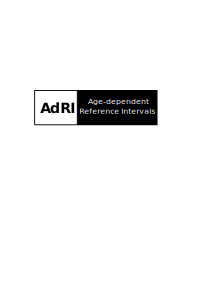

# Age-dependent-Reference-Intervals_Generator 



Generator for generating age-dependent data from biomarkers using functions or given reference intervals


This Shiny App is a generator to create age-dependent data from biomarkers, see the [Wiki](https://github.com/SandraKla/Age-dependent-Reference-Intervals_Generator/wiki). The generated data can be downloaded and can be used in [Age-dependent-Reference-Intervals](https://github.com/SandraKla/Age-dependent-Reference-Intervals), see also the [Wiki](https://github.com/SandraKla/Age-dependent-Reference-Intervals/wiki/Data-from-Generator). 

## Installation

Download the Zip-File from the Generator, set the working direction to the order with the Shiny App and run:

```bash
library(shiny)
runApp("app_generator.R")
```
