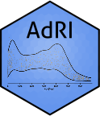
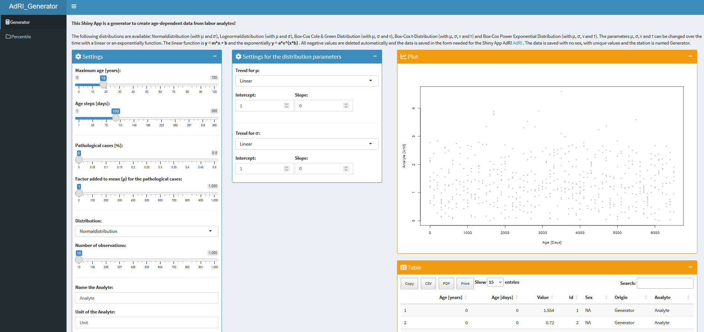

# Age-dependent-Reference-Intervals_Generator 

[]()
[]()
[]()
[]()



**Shiny App for generating age-dependent analyt-data using functions or given reference intervals!**

This Shiny App is a generator for creating age-dependent analyt-data (for more information see the [Wiki](https://github.com/SandraKla/Age-dependent-Reference-Intervals_Generator/wiki)). The data can be downloaded and used in the Shiny App [**AdRI**](https://github.com/SandraKla/Age-dependent-Reference-Intervals/wiki/Dataset#adri-generator). 




## Installation 

Download the Zip-File from this Shiny App and set your working direction to this path and run:

```bash
# Test if shiny is installed:
if("shiny" %in% rownames(installed.packages())){
  library(shiny)} else{
  install.packages("shiny")}
```

```bash
library(shiny)
runApp("app.R")
```
Or use the function ```runGitHub()``` from the package *shiny*:

```bash
library(shiny)
runGitHub("Age-dependent-Reference-Intervals_Generator", "SandraKla")
```

All required packages are downloaded when starting this app or imported if they already exist. For more information about the required packages use the [Wiki](https://github.com/SandraKla/Age-dependent-Reference-Intervals_Generator/wiki).
