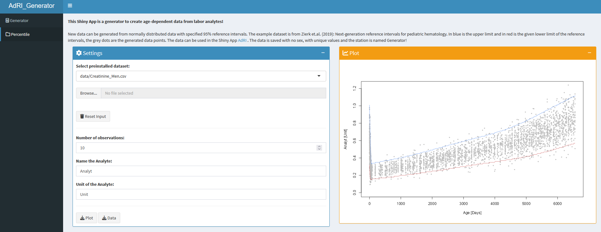

# Age-dependent-Reference-Intervals_Generator 


**Shiny App for generating age-dependent analyt-data using functions or given reference intervals!**

This Shiny App is a generator for creating age-dependent analyt-data (for more information see the [Wiki](https://github.com/SandraKla/Age-dependent-Reference-Intervals_Generator/wiki)). The data can be downloaded and used in the Shiny App [**AdRI**](https://github.com/SandraKla/Age-dependent-Reference-Intervals/wiki/Dataset#adri-generator). 




## Installation 

**Method 1:**
Use the function ```runGitHub()``` from the package [shiny](https://cran.r-project.org/web/packages/shiny/index.html):

```bash
if("shiny" %in% rownames(installed.packages())){
  library(shiny)} else{install.packages("shiny")}
runGitHub("Age-dependent-Reference-Intervals_Generator", "SandraKla")
```

**Method 2** (not recommended):
Download the Zip-File from this Shiny App. Unzip the file and set your working direction to the path of the folder. 
The package [shiny](https://cran.r-project.org/web/packages/shiny/index.html) (≥ 1.7.1) must be installed before using the Shiny App:

```bash
# Test if shiny is installed:
if("shiny" %in% rownames(installed.packages())){
  library(shiny)} else{install.packages("shiny")}
```
And then start the app with the following code:
```bash
runApp("app.R")
```

All required packages are downloaded when starting this app or imported if they already exist. For more information about the required packages use the [Wiki](https://github.com/SandraKla/Age-dependent-Reference-Intervals_Generator/wiki).

## Contact

You are welcome to:

- Submit suggestions and Bugs at: https://github.com/SandraKla/Age-dependent-Reference-Intervals_Generator/issues
- Make a pull request on: https://github.com/SandraKla/Age-dependent-Reference-Intervals_Generator/pulls

For more information use the [Wiki](https://github.com/SandraKla/Age-dependent-Reference-Intervals_Generator/wiki)! 
